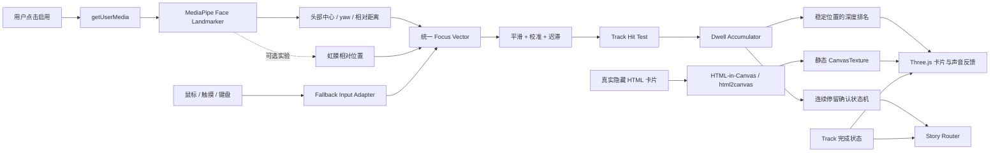
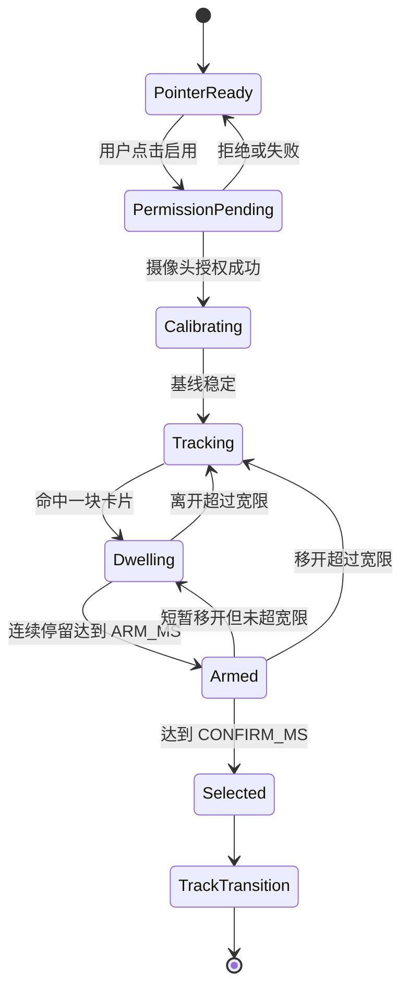

# 《归航 / NOSTOS》Track 凝视选择环节技术实现文档

> 版本：V1.0  
> 状态：设计可行，待实现  
> 目标：使用 HTML-in-Canvas、Three.js 与本地摄像头头部追踪，让用户通过视觉停留选择三条记忆 Track  
> 首选输入：头部朝向停留  
> 实验增强：眼球方向估算  
> 必备回退：鼠标、触摸、键盘

---

## 1. 结论

该交互可以在当前 Pear 复刻项目上实现，不需要从零验证底层能力。

当前代码已经具备：

1. 将真实 HTML 捕获为 Three.js `CanvasTexture` 的路径，并在原生能力不可用时回退到 `html2canvas`。
2. 三块 HTML 纹理平面在不同 X、Z 深度排列的空间场景。
3. MediaPipe Face Landmarker、本地摄像头、头部中心、相对距离和 yaw 估算。
4. 鼠标回退、输入平滑和带迟滞的左/中/右焦点切换。
5. 摄像头按需开启、退出时停止媒体轨道，以及 Three.js 模块动态加载。

仍需新增的是：停留时间累积、排名反馈、确认倒计时、Track 路由、完成状态和眼球方向实验模块。

### 可行性分级

| 能力 | 可行性 | 是否作为首发核心 | 说明 |
|---|---:|---:|---|
| 头部左右倾向选择 | 高 | 是 | 当前代码已经计算头部 X 与 yaw |
| 连续停留确认 | 高 | 是 | 使用 `requestAnimationFrame` 的时间差即可实现 |
| 三块 HTML 空间卡片 | 高 | 是 | 当前已有 HTML → CanvasTexture → Three.js 平面链路 |
| 鼠标、触摸、键盘回退 | 高 | 是 | 摄像头不应成为进入故事的门槛 |
| 眼球方向粗略估算 | 中 | 否 | 需要个人校准，受眼镜、光照、分辨率影响明显 |
| 服务端保存凝视轨迹 | 技术上可行 | 否 | 没有叙事必要，会引入不必要的生物特征与隐私风险 |

---

## 2. 体验设计

## 2.1 叙事定位

选择页面不是普通菜单，而是“奥德修斯的记忆在海面上重新排列”的仪式。

用户选择的是先观看哪一股记忆，而不是改变神话事件发生的历史顺序。三个 Track 均已发生；观看顺序可以不同。

三块主题画卷：

| 位置 | Track | 视觉符号 |
|---|---|---|
| 左 | 智慧与傲慢 | 莲花、独眼、风袋 |
| 中 | 诱惑与死亡 | 石港、金杯、冥界石碑 |
| 右 | 歌声与牺牲 | 音波、双崖、黑色太阳 |

三个位置在整个选择过程中保持固定。排名变化只能改变：

- Z 深度。
- 画面比例。
- 清晰度与亮度。
- 金色停留环完成度。
- 环境音量与空间声像。

禁止根据排名交换三块卡片的左右位置。用户正在观察的目标如果突然移动，会形成错误反馈循环并增加误选。

## 2.2 用户流程

### A. 默认状态

三块画卷在海面上方缓慢漂浮，摄像头尚未开启。

真实 DOM 按钮显示：

> 启用凝视航向  
> 影像只在本机处理，不录制、不上传

用户也可以直接使用鼠标、触摸或键盘选择，不会被强迫开启摄像头。

### B. 用户授权

点击按钮后才调用 `getUserMedia()`。浏览器拒绝或设备不可用时：

- 不显示错误弹窗阻断故事。
- 提示“摄像头不可用，已切换为指针航向”。
- 保持三块卡片和所有故事内容可访问。

### C. 中心校准

用户自然坐姿看向屏幕中心约 1.2–1.8 秒。

系统采集稳定头部中心和脸部宽度基线，显示一句叙事化提示：

> 保持目光在海平线上。

校准不是医疗或身份识别，不建立人脸模板。

### D. 探索与排名

用户看向左、中、右画卷：

- 当前候选卡片前移约 `0.12–0.22` 世界单位。
- 比例提高至 `1.035–1.055`。
- 清晰度提高，其他卡片轻微模糊。
- 停留分数开始累积，离开后缓慢衰减。
- 三块卡片按累计分数显示关注层级，但位置保持不变。

累计排名用于视觉反馈；真正触发选择必须同时满足“连续停留阈值”，避免用户来回浏览后意外进入最早看过的卡片。

### E. 待确认

连续稳定停留达到约 `1.8s` 后：

- 金色环闭合至 75%。
- 海浪和其他卡片的音量降低。
- 目标卡片出现呼吸式深度运动。
- DOM live region 宣布：“继续凝视以进入智慧与傲慢。”

### F. 进入 Track

继续停留约 `0.6s`：

- 金色环完全闭合。
- 卡片从原位置向中央移动并充满视口。
- 摄像头轨道停止。
- Track 资源预加载从 warm 状态切换为 active。
- Story Router 进入所选 Track。

在最后 `0.6s` 内移开视线超过 `250ms`，立即取消确认，不进入 Track。

### G. 完成 Track 后返回

完成的卡片：

- 变成带裂痕的金色航海铭牌。
- 移入海上中枢上方的“已记起”区域。
- 不参与主线停留选择。
- 可通过最终菜单重看，但不会重复修改完成状态。

三个 Track 全部完成后，不再启动摄像头选择。三块铭牌连接成一条垂直雷光，直接进入终章。

---

## 3. 系统数据流



### 关键边界

- 摄像头只负责产生本地 focus vector。
- HTML-in-Canvas 只负责生成卡片静态内容纹理。
- 停留环、排名和倒计时不能依赖每帧重新捕获 HTML。
- 路由只接受已经确认的 Track ID，不直接读取 landmarks。
- 原始视频帧、landmarks 和头部轨迹永远不进入业务状态或服务端接口。

---

## 4. HTML-in-Canvas 方案

## 4.1 为什么使用 HTML 卡片

每个 Track 卡片包含真实排版、标题、简介、进度状态和可访问文本。先用 HTML 排版，再转换为纹理，可以保持设计系统与网页字体一致，同时获得 Three.js 中真实的 Z 深度、遮挡和 off-axis 透视。

当前实现已经提供两条捕获路径：

```text
真实 HTML
→ 浏览器实验性 drawElementImage / drawElement
→ 失败时 html2canvas
→ Three.js CanvasTexture
→ PlaneGeometry
```

源码证据：

- `../references/pear-no/src/spatial/htmlTexture.js:15-20`：原生能力检测。
- `../references/pear-no/src/spatial/htmlTexture.js:22-53`：原生 HTML 捕获。
- `../references/pear-no/src/spatial/htmlTexture.js:55-66`：`html2canvas` 回退。
- `../references/pear-no/src/spatial/createSpatialScene.js:34-71`：纹理裁剪与三块平面创建。

## 4.2 静态纹理与动态反馈必须分离

`html2canvas` 不适合在 60 FPS 动画循环中反复运行。因此：

### 静态 CanvasTexture

只在以下事件重新捕获：

- 页面首次进入选择环节。
- 字体加载完成。
- 语言切换。
- Track 从未完成变为已完成。
- 响应式断点改变。

### 动态 GPU / Canvas Overlay

每帧更新：

- 停留环。
- 当前分数与深度。
- 模糊、亮度、比例。
- 粒子和海浪响应。
- 确认倒计时。

停留百分比可使用单独的环形 shader、Three.js `Line`，或小型 2D CanvasTexture；不要重新截图整个 HTML 卡片。

## 4.3 可访问性 DOM

Three.js 纹理不能被屏幕阅读器直接理解，也不是可点击的真实 DOM。因此页面必须保留一组视觉隐藏但语义完整的按钮：

```html
<fieldset aria-label="选择一股记忆之流">
  <button>智慧与傲慢</button>
  <button>诱惑与死亡</button>
  <button>歌声与牺牲</button>
</fieldset>
```

键盘焦点变化通过统一 Input Adapter 投射回 Three.js 卡片，产生与头部停留相同的视觉反馈。

---

## 5. 头部追踪与视线估算

## 5.1 首发方案：头部方向

首发版本使用头部方向而不宣称“精确眼动追踪”。

当前 `MediaPipeHeadTracker` 已经计算：

- 太阳穴 landmark `234 / 454`：脸部中心与宽度。
- 额头、下巴 landmark `10 / 152`：垂直中心。
- 前 24 帧脸宽：相对距离基线。
- facial transformation matrix：yaw。
- `focusX = headX × 0.42 + normalizedYaw × 0.78`。
- 推理限频约 24 Hz，渲染循环独立运行。

源码证据：`../references/pear-no/src/spatial/MediaPipeHeadTracker.js:64-100`。

头部方向的优点：

- 无需用户精准盯住一个像素。
- 在普通笔记本摄像头上更稳定。
- 用户能够理解“转头看向左、中、右”。
- 与三块横向卡片的空间设计一致。

## 5.2 实验方案：眼球方向

MediaPipe Face Landmarker 的高密度面部 landmarks 可用于估计虹膜在眼眶中的相对位置。实验模块可以计算：

```text
leftEyeRatio  = irisCenterLeft 相对左右眼角的位置
rightEyeRatio = irisCenterRight 相对左右眼角的位置
gazeX         = 两眼 ratio 的稳健平均值
focusX        = headPoseX * 0.65 + calibratedGazeX * 0.35
```

眼球信息只能用于小幅修正头部方向，不能在首发版本中独立决定 Track。需要：

- 左、中、右至少三点校准。
- 眨眼和闭眼过滤。
- 单眼被遮挡时降级。
- 眼镜反光、低光和摄像头低分辨率测试。
- 明确向用户称为“视线方向估算”，不能宣称医疗级或硬件级 eye tracking。

## 5.3 统一输入格式

所有输入最终转换为同一格式：

```ts
type FocusSample = {
  x: number;          // -1 左，0 中，1 右
  y: number;          // 当前版本只用于轻微视差
  z: number;          // 与屏幕相对距离
  confidence: number; // 0..1
  source: 'head' | 'head-gaze' | 'pointer' | 'keyboard';
  detected: boolean;
  timestamp: number;
};
```

Track Router 不允许接触摄像头或 MediaPipe 结果，只接收由选择状态机输出的 `trackId`。

---

## 6. 焦点判定与迟滞

三块卡片固定为左、中、右。当前 Pear 空间模块已有可复用的迟滞边界：

```text
中心 → 左：focusX < -0.30
左 → 中：focusX > -0.14
中心 → 右：focusX > 0.30
右 → 中：focusX < 0.14
```

源码证据：`../references/pear-no/src/spatial/createSpatialScene.js:160-166`。

迟滞意味着进入和离开卡片使用不同阈值，能避免用户在边界附近轻微抖动时焦点高速跳转。

推荐增加：

- 指数平滑：头部 `0.08–0.10`，视线 `0.05–0.08`。
- `dt` 最大按 `50ms` 计算，避免后台标签恢复后一次性增加大量停留时间。
- 人脸丢失超过 `200ms` 时暂停停留计时。
- 人脸丢失超过 `800ms` 时取消待确认状态。
- 页面不可见时立即暂停计时并停止确认倒计时。

---

## 7. 停留时间、排名与选择算法

## 7.1 为什么需要两种时间

系统维护两种不同数据：

1. **累计注意力分数 `attentionScore`**：决定三张卡片的视觉层级。
2. **连续停留时间 `continuousDwell`**：决定是否真的选择。

只使用累计时间会造成误选：用户先看左边三秒、后来认真看右边一秒，系统仍可能突然进入左边。

## 7.2 推荐参数

| 参数 | 初始值 | 含义 |
|---|---:|---|
| `ARM_MS` | 1800ms | 进入待确认状态所需的连续停留 |
| `CONFIRM_MS` | 600ms | 待确认后继续停留的时间 |
| `LEAVE_GRACE_MS` | 250ms | 短暂扫视或检测抖动的容忍时间 |
| `LOST_FACE_CANCEL_MS` | 800ms | 人脸丢失后取消确认 |
| `SCORE_GAIN` | 1.0 | 当前目标累计分数增长率 |
| `SCORE_DECAY` | 0.18 | 非当前目标分数衰减率 |
| `MIN_CONFIDENCE` | 0.55 | 参与停留计算的最低可信度 |

这些数值必须通过真实用户测试调整，不应作为最终真值。

## 7.3 伪代码

```ts
function updateDwell(sample: FocusSample, now: number) {
  const dt = Math.min(now - previousNow, 50);
  const candidate = resolveTrackWithHysteresis(sample.x);
  const valid = sample.detected && sample.confidence >= MIN_CONFIDENCE;

  for (const track of uncompletedTracks) {
    if (valid && track.id === candidate) {
      track.attentionScore = clamp(track.attentionScore + dt * SCORE_GAIN);
    } else {
      track.attentionScore = clamp(track.attentionScore - dt * SCORE_DECAY);
    }
  }

  if (!valid || candidate !== activeCandidate) {
    leaveDuration += dt;
    if (leaveDuration > LEAVE_GRACE_MS) {
      activeCandidate = valid ? candidate : null;
      continuousDwell = 0;
      state = activeCandidate ? 'DWELLING' : 'TRACKING';
    }
    return;
  }

  leaveDuration = 0;
  continuousDwell += dt;

  if (continuousDwell >= ARM_MS + CONFIRM_MS) {
    state = 'SELECTED';
    commitTrack(activeCandidate);
  } else if (continuousDwell >= ARM_MS) {
    state = 'ARMED';
  }
}
```

## 7.4 排名反馈

每帧根据 `attentionScore` 排名，但不改变 X 坐标：

```text
第一名：z + 0.18，scale 1.045，opacity 1.00
第二名：z + 0.05，scale 1.000，opacity 0.78
第三名：z - 0.08，scale 0.975，opacity 0.58
```

当前正在连续停留的卡片额外显示金色环。累计排名和当前候选可能不同，这是正常的：排名表达兴趣历史，金色环表达即将发生的选择。

---

## 8. 状态机



页面隐藏、路由离开、Track 进入或组件卸载时，任何状态都必须停止摄像头并清理 Three.js、MediaPipe 和事件监听器。

---

## 9. 推荐组件结构

不要直接把现有 `SpatialWork.jsx` 改名后继续堆逻辑。它当前硬编码了 `The Work` 的 Road 区间、文档滚动和 BUILD/RANK/SHARE 内容。建议复用底层数学与捕获代码，建立独立选择模块：

```text
src/track-selection/
  TrackSelectionScene.jsx       # 生命周期与 UI 组合
  TrackCardSource.jsx           # 三块真实 HTML 卡片
  createTrackSelectionScene.js  # Three.js 场景、相机、卡片与海面
  DwellSelectionController.js   # 分数、排名、连续停留、状态机
  FocusInputController.js       # head / gaze / pointer / keyboard 统一输入
  MediaPipeFocusTracker.js      # 从现有 HeadTracker 提取并扩展
  trackSelectionConfig.js       # 卡片位置、阈值、时间参数
  trackSelectionStore.js        # completed、selected、顺序
  TrackSelection.css
```

### 可直接复用

- `htmlTexture.js` 的原生捕获与 html2canvas fallback。
- `createSpatialScene.js` 的卡片纹理 repeat/offset、Three.js renderer、off-axis projection。
- `MediaPipeHeadTracker.js` 的摄像头生命周期、GPU/CPU fallback、24Hz 推理和基线校准。
- `SpatialWork.jsx` 的动态 import、指针回退、平滑和 dispose 流程。

### 需要重写

- 硬编码的三篇 essay 数据。
- focused document 的独立滚动逻辑。
- 当前只返回 label/progress/index 的状态结构。
- `The Work` 专属 Road 可见区间。
- 当前只依据 X 阈值切换、不统计停留时间的逻辑。

---

## 10. Story Router 与完成状态

推荐状态：

```ts
type TrackId = 'cunning-pride' | 'desire-death' | 'song-sacrifice';

type OdysseyProgress = {
  completedTrackIds: TrackId[];
  currentTrackId: TrackId | null;
  selectionOrder: TrackId[];
  selectionMethod: 'head-dwell' | 'head-gaze-dwell' | 'pointer' | 'keyboard';
};
```

进入 Track 时只写入 `currentTrackId`。完成 Track 后才把 ID 加入 `completedTrackIds`，防止用户进入后刷新页面就被误判为完成。

完成状态可以保存在 `localStorage`，但停留分数和摄像头数据不保存。提供“重新开始旅程”按钮时，清除范围只能是 Odyssey 自己的进度 key。

### 顺序相关文案

Story Router 向 Track 提供：

```ts
type TrackNarrativeContext = {
  visitIndex: 0 | 1 | 2;
  completedBefore: TrackId[];
  isLastRemaining: boolean;
};
```

用途：

- Track 3 早于 Track 2：使用“尚未说出的预言”文案。
- Track 2 晚于 Track 3：使用“已经实现的预言终于被说出”文案。
- 最后一个 Track：结尾不再恢复普通选择页面，而是把三块完成铭牌合成终章雷光。

---

## 11. 隐私与安全要求

## 11.1 默认原则

- 摄像头默认关闭。
- 只有用户点击明确按钮后请求权限。
- 视频元素隐藏但保留在本机内存中，不绘制给其他用户或发送至网络。
- MediaPipe 模型在本机运行。
- 不录制视频，不截取人脸照片，不保存 landmarks。
- 不把头部、眼睛、脸宽、yaw、停留轨迹写入日志、analytics 或 `localStorage`。
- 页面离开、标签页隐藏较久、选择完成或用户点击关闭时停止所有 media tracks。

## 11.2 可接受的匿名统计

如果未来确实需要产品统计，只发送：

```json
{
  "event": "track_selected",
  "trackId": "cunning-pride",
  "method": "head-dwell",
  "dwellBucket": "2-3s"
}
```

不得发送：视频帧、landmarks、精确 gaze 坐标、逐帧轨迹、脸部尺寸、设备摄像头标识。

## 11.3 浏览器条件

`getUserMedia()` 需要 HTTPS 或 localhost 安全上下文。摄像头权限必须由真实用户操作触发。

---

## 12. 性能设计

当前本地 Pear 资源测量结果：

- `public/films` 约 184 MB、2596 个 WebP/MP4 资源。
- MediaPipe WASM 约 34 MB。
- Face Landmarker 模型约 3.6 MB。

因此选择页面不能同时预加载三个完整 Track。

### 加载顺序

1. 序章期间仅加载选择页面三张静态卡片和 Three.js 基础场景。
2. 浏览器空闲时预取 MediaPipe WASM 与模型，但不启动摄像头。
3. 当前凝视第一名只预热对应 Track 的首屏 poster、首个音频 stem 和前 3–5 帧。
4. 达到 `ARMED` 后提高该 Track 的预加载优先级。
5. 确认选择后取消其他两个 Track 的非必要请求。
6. 完成 Track 返回海上中枢时，再预热剩余两个 Track。

### 渲染频率

- MediaPipe：约 24Hz。
- Three.js：前台激活时最多 60Hz。
- 页面不可见：停止选择计时与渲染循环。
- Renderer DPR：桌面最高 1.5，低性能设备 1.0。
- 排名 UI：只更新 GPU uniform 或对象 transform，不触发 HTML 重截图。

### WebGL context

选择场景应尽量使用主 Three.js renderer。不要为每块卡片各建一个 WebGL canvas，也不要同时保留不需要的 Hero、Footer 和 Spatial WebGL context。

---

## 13. 回退与无障碍

凝视交互是增强功能，不是唯一通道。

### 鼠标

- hover 等价于当前凝视候选。
- 停留环可以运行，但点击立即确认，不强迫等待 2.4 秒。

### 触摸

- 点击卡片进入预览状态。
- 再点击“进入这股记忆”确认。
- 移动端默认不请求前置摄像头。

### 键盘

- `Tab` 或左右箭头切换卡片。
- `Enter` 确认。
- `Escape` 取消待确认。
- 真实 DOM button 保持可访问名称和焦点顺序。

### Reduced motion

当 `prefers-reduced-motion: reduce`：

- 取消卡片大幅 Z 位移、镜头漂移和模糊。
- 保留边框、亮度和进度条反馈。
- 选择确认时间不变，避免行为不可预测。

---

## 14. 测试计划

## 14.1 功能测试

- 摄像头允许后进入校准并正常选择左、中、右。
- 摄像头拒绝后立即保留鼠标和键盘选择。
- 没有人脸时停留时间不增长。
- 快速扫过三块卡片不会触发选择。
- 在 `ARMED` 阶段移开视线会取消。
- Track 完成后正确变成铭牌并退出候选集合。
- 三个 Track 任意六种顺序均能进入终章。
- Track 2 / Track 3 条件旁白与完成顺序一致。

## 14.2 环境测试

- 明亮环境、低光、背光。
- 戴眼镜、无眼镜。
- 笔记本内置摄像头与普通外接摄像头。
- 用户距离约 45–90cm。
- 人脸短暂离开画面、第二个人进入背景。
- Chromium 摄像头权限允许、拒绝、撤销。

## 14.3 性能测试

- 选择页面稳定帧率和主线程长任务。
- MediaPipe 初始化期间 UI 不冻结。
- HTML 卡片只在规定事件重新捕获。
- 快速切换候选不重复创建纹理。
- 离开选择页面后摄像头指示灯熄灭、媒体轨道结束。
- Three.js geometry、material、texture 和 renderer 全部 dispose。

## 14.4 验收指标

以下是首轮可测试目标，不是尚未验证的事实：

- 三点校准后，参考设备上每个目标选择 10 次，成功至少 9 次。
- 连续快速浏览 5 秒，不发生自动误选。
- 从稳定注视到进入 Track 的时间落在 2.2–2.8 秒。
- 人脸丢失后不继续累计时间。
- 退出选择场景后 500ms 内调用媒体轨道 `stop()`。
- 未授权摄像头的用户仍能完成全部故事。

---

## 15. 实施阶段

### Phase 1：头部停留 MVP

- 三块静态 HTML 卡片。
- HTML → CanvasTexture。
- 复用当前头部 X / yaw。
- 迟滞、连续停留、取消和确认。
- 鼠标、键盘回退。
- 不做眼球方向、不做 analytics。

### Phase 2：故事状态整合

- 任意 Track 顺序。
- completed 铭牌。
- Track 2 / Track 3 条件旁白。
- 三条完成后进入终章。
- 本地进度恢复与重新开始。

### Phase 3：视觉和声音强化

- 停留环 shader。
- 排名深度与空间音频。
- 海面、星座和 Track 预加载响应。
- Reduced motion 与移动端专用排版。

### Phase 4：实验性视线修正

- 虹膜方向估算。
- 三点校准。
- 眼镜、低光、眨眼测试。
- 只在实际准确率优于纯头部方案时启用。

---

## 16. 已知信息、假设与待验证项

### 已确认

- 当前仓库已有 HTML-in-Canvas fallback、Three.js 空间卡片和 MediaPipe 头部追踪代码。
- 当前追踪是头部中心与 yaw，不是精确眼动追踪。
- 当前三卡片焦点切换已经使用迟滞。
- 当前摄像头只在用户主动点击后开启，并在卸载时停止。

### 设计假设

- 选择页面主要运行在桌面 Chromium。
- 用户允许用头部轻微左右移动表达关注方向。
- 三个 Track 可以任意顺序观看，但各 Track 内部 Episode 顺序固定。
- 视觉停留排名是本地即时反馈，不需要跨会话保存。

### 待真实验证

- 1.8s + 0.6s 是否是最自然的停留时长。
- 三卡片的屏幕间距是否足以避免边界误判。
- 眼球方向增强在眼镜、背光和低分辨率摄像头上的收益。
- MediaPipe 资源与首个 Track 素材并行加载时的低端设备表现。
- 用户是否能理解“凝视完成选择”，是否需要更明确的首次引导。

---

## 17. 证据与参考

### 当前仓库

- `../references/pear-no/src/spatial/SpatialWork.jsx:102-127`：摄像头按需启用与失败回退。
- `../references/pear-no/src/spatial/SpatialWork.jsx:141-188`：指针、滚轮、输入平滑和渲染循环。
- `../references/pear-no/src/spatial/createSpatialScene.js:34-71`：HTML 纹理卡片与独立深度。
- `../references/pear-no/src/spatial/createSpatialScene.js:160-176`：三卡片迟滞焦点与局部交互。
- `../references/pear-no/src/spatial/createSpatialScene.js:223-245`：off-axis projection。
- `../references/pear-no/src/spatial/htmlTexture.js:15-85`：原生 HTML 捕获与 html2canvas fallback。
- `../references/pear-no/src/spatial/MediaPipeHeadTracker.js:27-61`：摄像头、Face Landmarker 与 GPU/CPU fallback。
- `../references/pear-no/src/spatial/MediaPipeHeadTracker.js:64-100`：24Hz 推理、头部中心、距离与 yaw。
- `../references/pear-no/src/App.jsx:147-151`：接近场景时动态挂载空间模块。
- `../references/pear-no/README.md:60-82`：空间模块的数据流、迟滞和隐私边界说明。

### 官方文档

- MediaPipe Face Landmarker for Web：  
  https://developers.google.com/edge/mediapipe/solutions/vision/face_landmarker/web_js
- MDN `getUserMedia()`：  
  https://developer.mozilla.org/en-US/docs/Web/API/MediaDevices/getUserMedia
- MDN Page Visibility API：  
  https://developer.mozilla.org/en-US/docs/Web/API/Page_Visibility_API
- Three.js `CanvasTexture`：  
  https://threejs.org/docs/#api/en/textures/CanvasTexture
