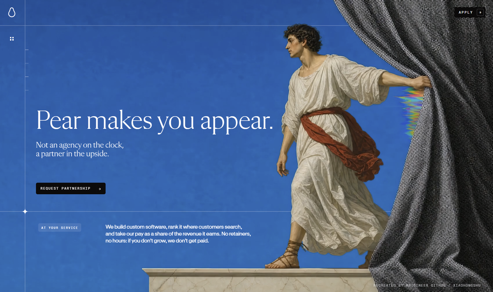
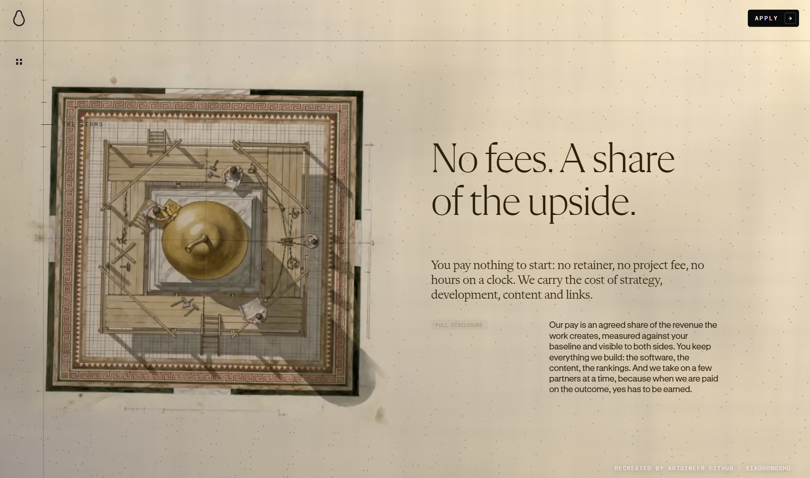
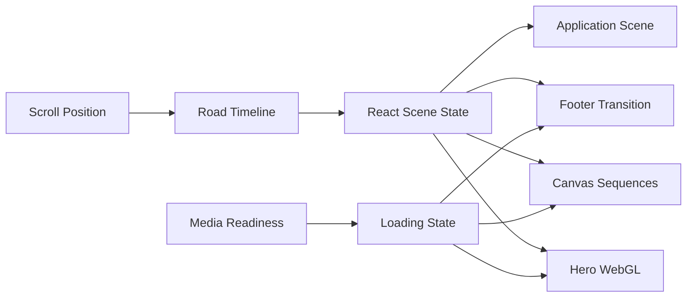
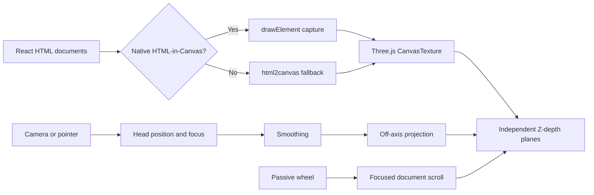

<div align="center">
<h1>Pear.No Clone</h1>

[中文文档](https://github.com/amasun/Pear-no/blob/main/README.md) · [English](https://github.com/amasun/Pear-no/blob/main/README.en.md) · [REPLICATION_LESSONS](https://github.com/amasun/Pear-no/blob/main/REPLICATION_LESSONS.md)

[L4 开发进度](L4_DEVELOPMENT_PROGRESS.md) · [L4 Development Progress](L4_DEVELOPMENT_PROGRESS.en.md)

**在线预览：[https://amasun.github.io/Pear-no/](https://amasun.github.io/Pear-no/)**

<p align="center">
  
  
  
  
</p>

<p align="center">
  <strong>Scroll-driven creative web experience recreation</strong><br />
  WebGL shaders · Canvas sequences · Responsive storytelling · Resource-safe transitions
</p>
</div>



这是一个基于 React + Vite 的 pear.no 网站体验复刻项目，重点还原滚动叙事、WebGL 背景、序列帧动画、遮罩合成和响应式布局。

原始站点：[https://pear.no/](https://pear.no/)

## 项目预览

<video src="https://github.com/user-attachments/assets/21d93997-d0d2-472b-a3f0-2891058f6577" controls muted loop playsinline width="100%"></video>

[下载预览视频](docs/assets/preview.mp4)

## 目录

- [项目概览](#项目概览)
- [Spatial Press Room](#spatial-press-room)
- [技术栈](#技术栈)
- [快速开始](#快速开始)
- [交互与加载](#交互与加载)
- [系统架构](#系统架构)
- [浏览器与隐私](#浏览器与隐私)
- [已知限制](#已知限制)
- [资源结构](#资源结构)
- [复刻说明](#复刻说明)

## 项目概览

| 模块 | 状态 | 说明 |
| --- | :---: | --- |
| 首屏 WebGL | `READY` | GLSL hero shader 与共享 hero video 时钟 |
| Scroll Road | `READY` | 桌面端、移动端统一逻辑时间线 |
| Mask Calibration | `READY` | 双击打开，支持位置、缩放和灵敏度调节 |
| Fly / Transition | `READY` | 序列帧预热与最近可用帧兜底 |
| Footer Shader | `READY` | 纹理就绪后再显示，避免黑屏 |
| Application | `READY` | 表单场景、hover 深度和申请弹窗 |
| Spatial Press Room | `EXPERIMENTAL` | HTML-in-Canvas、Three.js 深度、头部追踪与 off-axis 投影 |

## Spatial Press Room

`The Work` 章节现在是一间嵌入原滚动叙事的空间出版室。BUILD、RANK、SHARE 三份真实 HTML 文档先由浏览器排版，再转换为 Three.js `CanvasTexture`，分别放在不同 Z 深度。中间的梨形线框与信号粒子进一步提供空间参照，因此视差来自真实透视投影，而不是 CSS 同步平移。

### How it works

```text
React HTML source
  → Native drawElementImage / drawElement（可用时）
  → html2canvas fallback（不可用或捕获失败时）
  → Three.js CanvasTexture + three independent planes
  → MediaPipe Face Landmarker / pointer fallback
  → smoothed head position + head yaw
  → off-axis window projection
  → view-dependent spatial parallax
```

交互采用两条同时存在的时间线：

- **Pear road**：原有页面滚动、视频、GLSL、Canvas 序列、FAQ、Application 与 footer 继续由全局滚动位置驱动。
- **Focused document**：头部姿态或鼠标横向位置选择左、中、右文档；滚轮只推进当前文档自己的纹理视窗，另外两份文档保持各自进度。

空间层的 wheel listener 是 passive，不调用 `preventDefault`，所以不会截断原站滚动。焦点切换带迟滞阈值，防止头部轻微抖动导致文档来回跳转。Three.js 只在接近 `The Work` 时动态加载，MediaPipe 只在用户主动启用摄像头后加载。

## 工具链

| 阶段 | 工具 | 用途 |
| --- | --- | --- |
| 原项目实现 | ChatGPT · Seedance · Claude | 图像提示与素材生成、慢速影像、生产代码实现 |
| 复刻还原 | ChatGPT · Gemini | 运行时分析、视觉比对、代码复刻与问题排查 |

原项目创作管线来自公开的技术描述；复刻工具用于理解原站行为并在本地重建体验，两者职责不同。


## 项目内容

- 自定义 GLSL WebGL 首屏背景与人物影像
- Canvas 2D 序列帧、转场和 chroma-key 遮罩
- 桌面端与移动端一致的 road 滚动时间线
- 导航、章节 rail、FAQ 旋转内容和 footer 转场
- Application 表单场景与弹窗交互
- 可调节首屏 mask 的校准控制面板
- 首屏、fly、transition、footer 的资源加载与失败兜底


## 技术栈

| 层级 | 技术 |
| --- | --- |
| 应用层 | React 19 · Vite 6 · pnpm |
| 图形层 | WebGL · GLSL · Three.js · HTML Canvas 2D |
| 空间输入 | MediaPipe Tasks Vision · Face Landmarker · pointer fallback |
| HTML 捕获 | Native HTML-in-Canvas · html2canvas fallback |
| 动画层 | Scroll timeline · requestAnimationFrame · off-axis projection · CSS motion |
| 视觉层 | SVG overlays · Chroma-key masking · Responsive layout |

## 动画资产清单

| 动画片段 | 资源类型 | 数量 | 资源链接 |
| --- | --- | ---: | --- |
| Hero / Signal | MP4 + poster | 1 MP4 | [`signal.mp4`](public/films/signal.mp4) · [`poster`](public/films/signal-poster.jpg) |
| Hero / Colossus | MP4 + poster | 1 MP4 | [`colossus.mp4`](public/films/colossus.mp4) · [`poster`](public/films/colossus-poster.jpg) |
| Hero / Reveal | MP4 + poster | 1 MP4 | [`reveal.mp4`](public/films/reveal.mp4) · [`poster`](public/films/reveal-poster.jpg) |
| Model / Bridge v28 | WebP sequence | 121 / tier | [`v28`](public/films/model/v28/) |
| Model / Bridge v51 | WebP sequence | 121 / tier | [`v51`](public/films/model/v51/) |
| Model / Bridge v61 | WebP sequence | 121 / tier | [`v61`](public/films/model/v61/) |
| Model / Renaissance | WebP sequence | 362 / tier | [`renaissance`](public/films/model/renaissance/) |
| Coda | WebP sequence | 89 / tier | [`coda`](public/films/coda/) |
| Plan | WebP sequence | 121 / tier | [`plan`](public/films/plan/) |
| Tree | WebP sequence | 121 / tier | [`tree`](public/films/tree/) |
| Flysky | WebP sequence | 121 / tier | [`flysky`](public/films/flysky/) |
| Transition | WebP sequence | 121 / tier | [`trans`](public/films/trans/) |
| Footer loop | MP4 | 1 MP4 | [`footer-loop.mp4`](public/films/footer-loop.mp4) |

> ` / tier` 表示桌面端与移动端各有一套资源。Model 每个 bridge 片段与 Renaissance 分别为 121 和 362 帧，因此单条逻辑 Model 序列为 483 帧。

```text
Browser
  ├─ React App
  │   ├─ Scroll Road / Navigation / Narrative
  │   ├─ HeroCanvas ─────── GLSL + shared hero video
  │   ├─ SequenceCanvas ─── 2D frames + mask compositing
  │   ├─ SpatialWork ─────── HTML textures + Three.js + head view
  │   ├─ ApplicationScene ─ form scene + orbit geometry
  │   └─ FooterTransition ─ WebGL texture transition
  ├─ public/films ───────── local video, poster and frame assets
  └─ public/models ──────── local Face Landmarker model + WASM runtime
```

## 快速开始

```bash
pnpm install
pnpm dev
```

默认开发服务地址：

`http://localhost:3000/Pear-no/`

生产构建与预览：

```bash
pnpm build
pnpm preview
```

## 交互与加载

### 首屏 loading

首屏 loading 由真实资源状态驱动。Poster 或 hero video 可绘制后，loading 状态自动消失；不会因为固定延时导致空白画布提前出现。

如果首屏资源连续 10 秒无法加载，页面会显示错误信息和 `Retry` 按钮。

fly、transition 和 footer 阶段采用非阻塞加载。资源尚未完成时，会继续显示最近可用帧，并在底部提示当前加载阶段，避免快速滚动造成黑屏。



### Mask 校准面板

> [!IMPORTANT]
> **校准面板默认隐藏。双击页面空白区域即可打开或关闭。**

面板提供以下控制项：

- `Zoom / Overscan`
- `Object Position X`
- `Sky Sensitivity`
- mask debug 开关
- reset 与 preset
- road 位置读取与拖拽定位

校准参数会保存到浏览器的 `localStorage` 中。

### Application 场景

Application 区域包含三个虚线椭圆、发光粒子、表单字段和发送按钮。椭圆保持与原站一致的静态姿态，避免出现异常快速旋转。

## 系统架构



空间模块内部的数据流：



## 浏览器与隐私

### 浏览器要求

- 推荐桌面版 Chromium / Chrome，并使用 WebGL 2。
- 原生 HTML-in-Canvas 目前仍是实验能力。打开 `chrome://flags/#canvas-draw-element`，启用对应选项并完整重启 Chrome；进入 `The Work` 后，右下角应显示 `Native HTML-in-Canvas`。
- 若浏览器没有暴露 `CanvasRenderingContext2D.drawElementImage` / `drawElement`，或原生捕获失败，运行时会自动使用 `html2canvas`。页面、3D 深度、独立滚动和鼠标视差仍可工作，右下角显示 `Fallback DOM capture`。
- 摄像头需要安全上下文：生产环境使用 HTTPS；本地 `localhost` 可直接申请权限。

### Camera privacy

摄像头不会在页面加载时自动开启。只有点击 `Enable head view` 后才会调用 `getUserMedia()`；画面默认不可见，仅由本地 MediaPipe Face Landmarker 处理，不录制、不上传、不做人脸识别。点击 `Disable head view`、离开页面或组件卸载时会停止媒体轨道。拒绝权限或模型加载失败时，系统保留鼠标视差。

追踪使用脸部 landmarks `234 / 454 / 10 / 152` 估计中心、垂直位置与相对距离，并结合 facial transformation matrix 的 yaw 判断左/中/右焦点。24 帧基线用于相对距离校准，推理限频约 24Hz，渲染循环保持独立。

## 已知限制

- HTML-in-Canvas 属于实验浏览器 API，名称、flag 与具体行为可能随 Chromium 版本变化；fallback 是长期兼容路径。
- 跨域字体、图片或媒体仍受 Canvas origin-clean / CORS 限制；当前空间文档只使用同源样式和文本。
- Three.js 中显示的是 HTML 的纹理快照，不是可直接点击的 DOM。摄像头按钮保留为真实 DOM；空间文档通过头部/鼠标聚焦和滚轮交互，若未来加入链接或表单，需要额外的 raycast-to-DOM 事件转发层。
- 当前识别的是头部中心与头部 yaw，不是精密眼动追踪；眼睛转动但头部不动时不会可靠切换焦点。
- MediaPipe 延迟取决于设备、摄像头帧率和 GPU/WebGL 驱动。推理与渲染已解耦，但低端设备仍可能降低响应速度。
- 距离 Z 是基于人脸宽度相对初始 24 帧的估算，会受到摄像头视场角、姿态和初始坐姿影响。
- 移动端没有稳定的前置摄像头观看姿态假设，空间排版会只突出当前文档，建议主要在桌面 Chromium 体验头部耦合效果。

## 截图画廊

| Hero | Model | Terms |
| --- | --- | --- |
|  |  |  |

## 资源结构

- `src/App.jsx`：页面组合、滚动状态和全局交互
- `src/components/`：页面区块、Canvas、弹窗和加载状态组件
- `src/glsl/`：hero 与 footer transition shader
- `src/spatial/SpatialWork.jsx`：空间章节生命周期、输入路由、平滑与隐私控制
- `src/spatial/createSpatialScene.js`：Three.js 场景、三张深度平面、独立滚动和 off-axis 投影
- `src/spatial/htmlTexture.js`：原生 HTML-in-Canvas 探测与 html2canvas progressive enhancement
- `src/spatial/MediaPipeHeadTracker.js`：摄像头、Face Landmarker、头部坐标与 yaw 焦点
- `public/films/`：视频、海报和序列帧资源
- `public/models/`、`public/mediapipe/`：本地 Face Landmarker 模型与 WASM runtime
- `docs/assets/`：README 展示图片

## 常用命令

| 命令 | 用途 |
| --- | --- |
| `pnpm dev` | 启动开发服务 |
| `pnpm build` | 生成生产构建 |
| `pnpm preview` | 预览生产构建 |
| 双击页面 | 打开 / 关闭 mask 校准面板 |

## 复刻说明

本项目用于本地研究和技术学习。项目中的视觉素材、品牌和原站内容仍归其原作者所有，请勿未经授权用于商业发布。

复刻过程中的技术分析、动画拆解、资源加载排查和实现经验，详见 [REPLICATION_LESSONS.md](REPLICATION_LESSONS.md)。

### REPLICATION_LESSONS 摘要

- 将网站视为由滚动驱动的叙事系统，而不是静态区块的集合。
- 先定义统一的 Road 逻辑时间轴，再映射场景的开始、持有和退出区间。
- 将视频和序列帧当作有时间关系的视觉资源，明确 cover 规则、锚点、移动端分支和交叉淡化。
- 让网格线、文案、水墨效果、mask 和 hover 深度由场景状态驱动，而不是固定装饰或布局变化。
- 水墨效果需要真实的 alpha 合成；表单 hover 应使用合成层 transform，避免布局抖动。
- 在桌面端和移动端验证场景边界、loading 兜底、computed style 和生产构建。

## Credits

Recreated by Artgineer

- [GitHub](https://github.com/amasun?tab=repositories)
- [Xiaohongshu](https://www.xiaohongshu.com/user/profile/5c094b50f7e8b948da476607)
